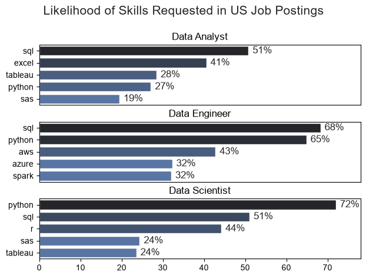
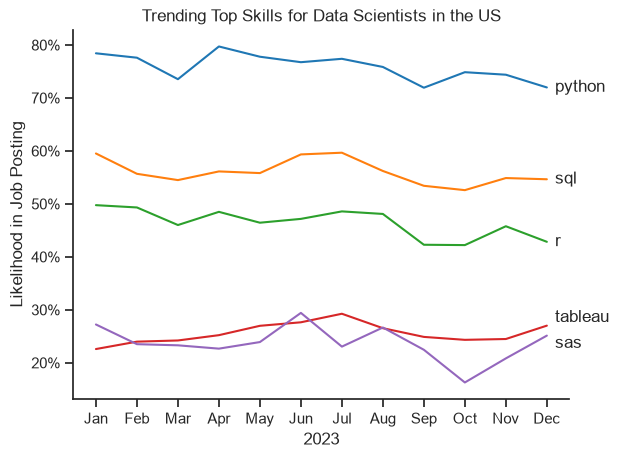
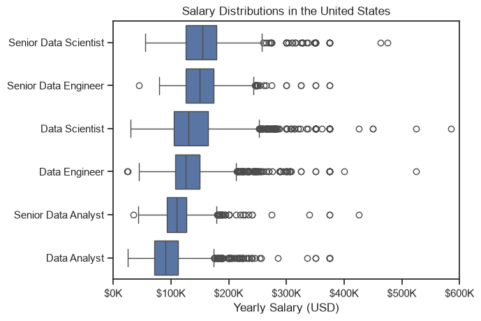
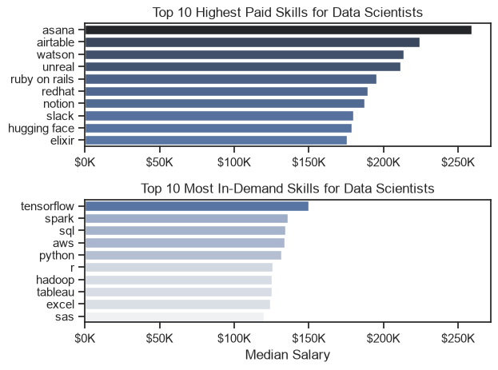
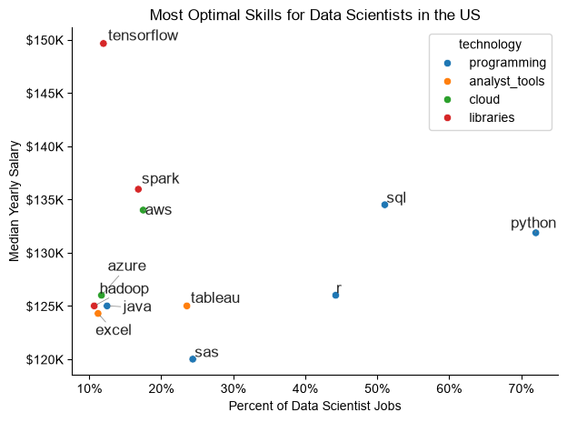

# Overview

Welcome to my analysis of the data job market, focusing on data scientists roles. This project was created out of a desire to navigate and understand the job market more effectively. It delves into the top-paying and in-demand skills to help find optimal job opportunities for data scientists.

The data sourced from [Luke Barousse's Python Course](https://www.youtube.com/watch?v=wUSDVGivd-8) which provides a foundation for my analysis, containing detailed information on job titles, salaries, locations, and essential skills. Through a series of Python scripts, I explore key questions such as the most demanded skills, salary trends, and the intersection of demand and salary in data scientists.

# The Questions

Below are the questions that I want to answer in my project:

1. What are the skills most in demand for the top 3 most popular data roles?
2. How are in-demand skills trending for Data Scientists?
3. How well do jobs and skills pay for Data Scientists?
4. What are the optimal skills for Data Scientists to learn?

# Tool I used

For my deep dive into the data scientist job market, I used the following tools:

- **Python:** The backbone of my analysis, allowing me to analyze the data and find critical insights. I also used the following Python libraries:
    - **Pandas Library:** This was used to analyze the data.
    - **Matplotlib Library:** This was used to visualize the data.
    - **Seaborn Library:** Helped me create more advanced visuals.
- **Jupyter Notebooks:** The tool I used to run my Python scripts.
- **Visual Studio Code:** This tool was used for executing my Python scripts.
- **Git & GitHub:** Essential for version control and sharing my Python code and analysis.

# Data Prep and Cleanup
## Import and Cleanup Data

I started by importing the necessary libraries and loading in the dataset, which was followed with the data cleaning tasks.

```python
# Importing Libraries
import ast
import pandas as pd
import seaborn as sns
from datasets import load_dataset
import matplotlib.pyplot as plt  

# Loading Data
dataset = load_dataset('lukebarousse/data_jobs')
df = dataset['train'].to_pandas()

# Data Cleanup
df['job_posted_date'] = pd.to_datetime(df['job_posted_date'])
df['job_skills'] = df['job_skills'].apply(lambda x: ast.literal_eval(x) if pd.notna(x) else x)
```

## Filter US Jobs
I focused my analysis on the US job market, so I applied this filter to narrow it down to the United States.
```python
df_US = df[df['job_country'] == 'United States']
```

# The Analysis

## 1. What are the most demanded skills for the top 3 most popular data roles?


To find the most demanded skills for the top 3 most popular data roles, I filtered out those positions by which ones were the most popular, and got the top 5 skills for these top 3 roles. This query highlights the most popular job titles and their job skills, showing which skills I should be paying attention to depending on the role I am targeting.

View my notebook with the detailed steps here:
[2_Skills_Demand](3_Project/2_Skills_Demand.ipynb)

### Visualize Data

```python
fig, ax = plt.subplots(len(job_titles), 1)
sns.set_theme(style='ticks')

for i, job_title in enumerate(job_titles):
    df_plot = df_skills_percent[df_skills_percent['job_title_short'] == job_title].head(5)
    sns.barplot(data=df_plot, x='skill_percent', y='job_skills', ax=ax[i], hue='skill_count', palette='dark:b_r')
    ax[i].set_title(job_title)
    ax[i].set_ylabel('')
    ax[i].set_xlabel('')
    ax[i].get_legend().remove()
    ax[i].set_xlim(0, 78)

    for n, v in enumerate(df_plot['skill_percent']):
        ax[i].text(v + 1, n, f'{v:.0f}%', va='center')

    if i != len(job_titles) - 1:
        ax[i].set_xticks([])

fig.suptitle('Likelihood of Skills Requested in US Job Postings', fontsize=15)
fig.tight_layout(h_pad=0.5)
plt.show()
```

### Results



### Insights

- Python is the most versatile skill, as it is highly demanded in all three roles, but most prominently for Data Scientists and Data Engineers.
- SQL is the most requested skill for Data Analysts and Data Scientists, with it in over half of the job postings for both roles.
- Data Engineers require more specialized technical skills, such as AWS, Azure, and Spark. Data Analysts and Data Scientists are expected to be proficient in more general data management and analysis tools, such as Excel and Tableau.

## 2. How are in-demand skills trending for Data Scientists?

To find how skills are trending in 2023 for Data Scientists, I filtered data scientist positions and grouped the skills by the month of the job postings. This got me the top 5 skills of data scientists by month, showing how popular skills were throughout 2023.

View my notebook with detailed steps here:
[3_Skills_Trends](3_Project/3_Skills_Trend.ipynb)

### Visualize Data

```python
sns.lineplot(data=df_plot, dashes=False, palette='tab10')
sns.set_theme(style='ticks')
sns.despine()

plt.title('Trending Top Skills for Data Scientists in the US')
plt.ylabel('Likelihood in Job Posting')
plt.xlabel('2023')
plt.legend().remove()

from matplotlib.ticker import PercentFormatter
ax = plt.gca()
ax.yaxis.set_major_formatter(PercentFormatter())

for i in range(5):
    label = df_plot.columns[i]
    y_val = df_plot.iloc[-1, i]
    
    if label == 'tableau':
        y_val += 1.5
    elif label == 'sas':
        y_val -= 1.5
        
    plt.text(11.2, y_val, label, va='center')

plt.show()
```
### Results


### Insights:
- Python consistently reigns supreme as the most demanded skill, holding a strong lead throughout 2023 and hovering comfortably between 70% and 80% in job postings.
- SQL and R maintain stable, both having distinct positions in the middle tier, with SQL steadily fluctuating in the 50s and R remaining in the 40s.
- Tableau and SAS closely compete for the final slot around the 20% to 30% range, notably experiencing an intersection in June before SAS dips significantly in October and rallies back by December.
- This graph proves that these technologies are safe to learn and are not trending towards being obsoluete in the near future.

## 3. How well do jobs and skills pay for Data Scientists?

To identify the highest-paying roles and skills, I only got jobs in the United States and looked at their median salary. But first I looked at the salary distributions of common data jobs like Data Scientist, Data Engineer, and Data Analyst, to get an idea of which jobs are paid the most.

View my notebook with detailed steps here: [4_Salary_Analysis](3_Project/4_Salary_Analysis.ipynb)

### Salary Analysis for Data Jobs

### Visualize Data

```python
sns.boxplot(data=df_US_top6, x='salary_year_avg', y='job_title_short', order=job_order)
sns.set_theme(style='ticks')

plt.title('Salary Distributions in the United States')
plt.xlabel('Yearly Salary (USD)')
plt.ylabel('')
plt.xlim(0, 600000) 
ticks_x = plt.FuncFormatter(lambda y, pos: f'${int(y/1000)}K')
plt.gca().xaxis.set_major_formatter(ticks_x)
plt.show()
```
### Results


### Insights

- Senior positions command the highest pay scales, with Senior Data Scientists and Senior Data Engineers sharing the highest median salaries at roughly $150,000. This is not true for Senior Data Analyst, as their pay is lower than Data Engineers and Data Scientists.
- Data Scientists generally edge out Data Engineers across both experience levels, while Data Analysts consistently hold the lowest overall earning brackets with a base median just under $100,000.
- Every role features heavy right-skewed outliers extending past $300,000, but mid-level Data Scientists show the most extreme variance with individual salaries stretching close to $600,000.

### Highest Paid & Most Demanded Skills for Data Scientists

```python
fig, ax = plt.subplots(2, 1)

sns.set_theme(style='ticks')

sns.barplot(data=df_DS_top_pay, x='median', y=df_DS_top_pay.index, ax=ax[0], hue='median', palette='dark:b_r')
ax[0].legend().remove()

ax[0].set_title('Top 10 Highest Paid Skills for Data Scientists')
ax[0].set_ylabel('')
ax[0].set_xlabel('')
ax[0].xaxis.set_major_formatter(plt.FuncFormatter(lambda x, _: f'${int(x/1000)}K'))

sns.barplot(data=df_DS_skills, x='median', y=df_DS_skills.index, ax=ax[1], hue='median', palette='light:b')
ax[1].legend().remove()

ax[1].set_title('Top 10 Most In-Demand Skills for Data Scientists')
ax[1].set_ylabel('')
ax[1].set_xlabel('Median Salary')
ax[1].set_xlim(ax[0].get_xlim())
ax[1].xaxis.set_major_formatter(plt.FuncFormatter(lambda x, _: f'${int(x/1000)}K'))

fig.tight_layout()
```
### Results


### Insights
- Niche project management and collaboration software command a massive premium over core technical tools. asana leads the highest-paid chart at a staggering median salary of over $250,000, while platforms like airtable, notion, and slack dominate the upper tier. This indicates that data scientists who possess advanced workflow capabilities or specialize in integrating these tools are highly compensated.
- Specialized engineering and enterprise platforms outpace standard analytical frameworks in compensation. Enterprise systems like watson and redhat, along with game development engines like unreal, drive median salaries past the $190,000 to $210,000 range. These specializations yield higher pay than popular machine learning frameworks like hugging face, which sits closer to $180,000.
- High market demand does not automatically translate to the highest pay scales. The most widely requested foundational skills max out with tensorflow at roughly $150,000 and scale down to around $120,000 for legacy tools like sas. This suggests a clear market trade-off where these tools offer excellent job security but face salary caps due to a larger pool of qualified candidates, but these medians likely come from a few postings, so treat them cautiously.
- Core technical staples display remarkable salary consistency within the high-demand tier. Foundational pillars like spark, sql, aws, and python all tightly cluster together with a median payout hovering between $130,000 and $135,000. This baseline represents the predictable market rate for a well-rounded data professional, which visibly outpaces traditional office software like excel.

## 4. What is the most optimal skill to learn for Data Scientists?

To identify the most optimal skills to learn ( the ones that are the highest paid and highest in demand) I calculated the percent of skill demand and the median salary of these skills. To easily identify which are the most optimal skills to learn.

View my notebook with detailed steps here: [5_Optimal_Skills](3_Project/5_Optimal_Skills.ipynb)

### Visualize Data

```python
sns.scatterplot(
    data=df_plot,
    x='skill_percent',
    y='median_salary',
    hue='technology'
)

sns.despine()
sns.set_theme(style='ticks')
texts = []
for i, txt in enumerate(df_DS_skills_high_demand.index):
    texts.append(plt.text(df_DS_skills_high_demand['skill_percent'].iloc[i], df_DS_skills_high_demand['median_salary'].iloc[i], txt))

adjust_text(texts, arrowprops=dict(arrowstyle='->', color='gray', lw=0.5))

from matplotlib.ticker import PercentFormatter 
ax = plt.gca()
ax.yaxis.set_major_formatter(plt.FuncFormatter(lambda y, pos: f'${int(y/1000)}K'))
ax.xaxis.set_major_formatter(PercentFormatter())

plt.xlabel('Percent of Data Scientist Jobs')
plt.ylabel('Median Yearly Salary')
plt.title('Most Optimal Skills for Data Scientists in the US')

plt.tight_layout()
plt.show()
```
### Results



### Insights

- Programming skills like Python and SQL dominate market demand, appearing in roughly 72% and 51% of job listings respectively. However, this widespread adoption correlates with more moderate median salaries hovering between $132K and $135K.
- Tensorflow represents the highest-paying libraries skill on the chart, commanding a premium median yearly salary near $150K. Conversely, it remains a highly specialized tool that is requested in only about 12% of data scientist positions.
- Traditional analyst tools like SAS and Excel yield the lowest financial returns, with median salaries sitting at the bottom of the chart between $120K and $124K. They also lag behind in market relevance, appearing in fewer than 25% of active job postings.

# What I Learned

Through this project, I built hands-on experience analyzing a real job postings dataset with Python and turned the results into charts and takeaways. A few specific things I learned:

- **Data Manipulation with Pandas:** I used `explode`, `groupby`, `pivot_table`, and `merge` to turn a column of skill lists into counts, percentages, and median salaries.
- **Visualization with Matplotlib and Seaborn:** I built bar charts, line charts, box plots, and scatter plots, and learned that formatting (labels, percent and dollar axes, readable titles) matters as much as the data.
- **Counts vs. Percentages:** Raw counts can mislead. Converting skill counts to a percentage of job postings made it possible to compare roles and months fairly.
- **Reading Charts Carefully:** Writing the insights taught me to check each claim against the chart instead of assuming what it shows.

# Insights

This project gave me a few general insights into the Data Scientist job market in the US (2023 postings):

- **Python and SQL Are the Core:** Python appeared in about 72% of Data Scientist postings and SQL in about 51%, and both stayed steady through 2023.
- **Demand and Pay Are Not the Same Thing:** The most requested skills (Python, SQL, R) have median salaries around $125K to $135K, while the highest-paid skills (like Asana, Airtable, and Watson) are rare in postings, so those medians come from small samples.
- **Seniority Raises Pay:** Senior Data Scientists and Senior Data Engineers have the highest median salaries at roughly $150K, and Data Analysts have the lowest.
- **Specialized Skills Can Pay More:** TensorFlow had the highest median salary (about $150K) among the skills requested in at least 10% of postings, though it appears in only about 12% of them.

# Challenges I Faced

- **Missing Salary Data:** Many postings do not list a salary, so salary results are based on a smaller portion of the dataset than the demand results.
- **Skills Stored as Lists:** The skills column had to be cleaned and exploded so each skill had its own row before I could count anything.
- **Outliers:** Some salaries stretch toward $600K, which required using medians instead of averages.
- **Readable Charts:** Keeping labels from overlapping on the scatter plot and formatting axes took several rounds of adjustment.

# Conclusion

This project gave me practical experience taking a large, messy dataset from raw data to clear findings. The results show that Python and SQL are the foundation skills for Data Scientists, while the highest salaries tend to go with specialized, less common skills. The data covers one year of US postings, so these are patterns in the market rather than guarantees. I plan to apply the same process to future projects, such as comparing other roles or looking at skills by location.