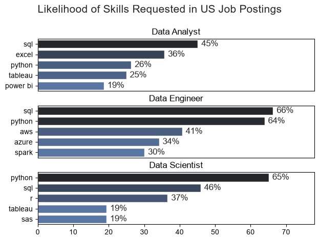
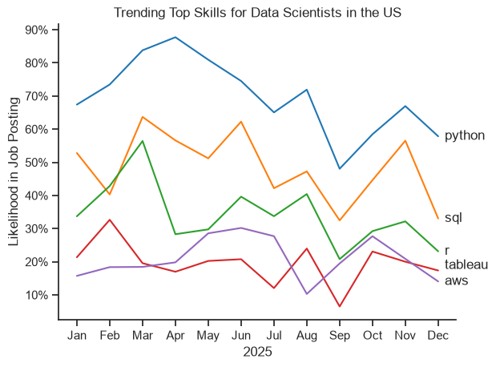
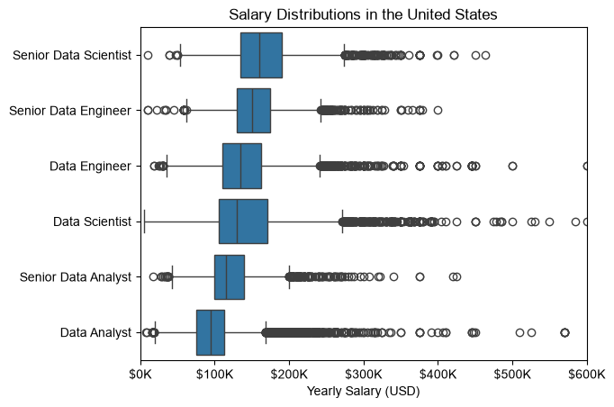
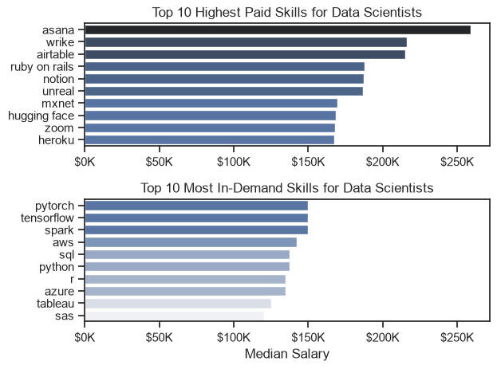
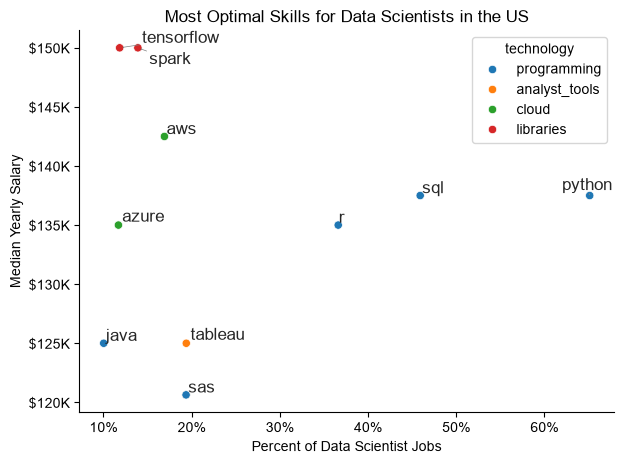

# Overview

Welcome to my analysis of the data job market, focusing on data scientists roles. This project was created out of a desire to navigate and understand the job market more effectively. It delves into the top-paying and in-demand skills to help find optimal job opportunities for data scientists.

The data is sourced from [Luke Barousse's Python Course](https://www.youtube.com/watch?v=wUSDVGivd-8) which provides a foundation for my analysis, containing detailed information on job titles, salaries, locations, and essential skills. Through a series of Python notebooks, I explore key questions such as the most demanded skills, salary trends, and the intersection of demand and salary in data scientists.

# The Questions

Below are the questions that I want to answer in my project:

1. What are the skills most in demand for the top 3 most popular data roles?
2. How are in-demand skills trending for Data Scientists?
3. How well do jobs and skills pay for Data Scientists?
4. What are the optimal skills for Data Scientists to learn?

# Tools I used

For my deep dive into the data scientist job market, I used the following tools:

- **Python:** The backbone of my analysis, allowing me to analyze the data and find critical insights. I also used the following Python libraries:
    - **Pandas Library:** This was used to analyze the data.
    - **Matplotlib Library:** This was used to visualize the data.
    - **Seaborn Library:** Helped me create more advanced visuals.
- **Jupyter Notebooks:** The tool I used to run my Python scripts.
- **Visual Studio Code:** This tool was used for executing my Python scripts.
- **Git & GitHub:** Essential for version control and sharing my Python code and analysis.

# Data Prep and Cleanup

## About the Data

The analysis uses `job_postings_flat.csv`, a dataset of data-related job postings (job titles, salaries, locations, and skills) provided with Luke Barousse's [Python for Data Analytics course](https://lukebarousse.com/python). The dataset is part of the paid course materials, so it is not included in this repository. The postings I analyzed were posted between 2023 and 2026.

If you want to follow along, the course includes the data. A free 2023 version of the dataset is also available on Hugging Face (`lukebarousse/data_jobs`), but it contains older postings, so your results will differ from mine.

## Import and Cleanup Data

I started by importing the necessary libraries and loading in the dataset, which was followed with the data cleaning tasks.

```python
# Importing Libraries
import ast
import pandas as pd
import seaborn as sns
import matplotlib.pyplot as plt  

# Loading Data
df = pd.read_csv('job_postings_flat.csv')

# Data Cleanup
df['job_posted_date'] = pd.to_datetime(df['job_posted_date'])
df['job_skills'] = df['job_skills'].apply(lambda x: ast.literal_eval(x) if pd.notna(x) else x)
```

## Filter US Jobs
I focused my analysis on the US job market, so I applied this filter to narrow it down to the United States.
```python
df_US = df[df['job_country'] == 'United States']
```

# The Analysis

## 1. What are the most demanded skills for the top 3 most popular data roles?


To find the most demanded skills for the top 3 most popular data roles, I filtered out those positions by which ones were the most popular, and got the top 5 skills for these top 3 roles. This query highlights the most popular job titles and their job skills, showing which skills I should be paying attention to depending on the role I am targeting.

View my notebook with the detailed steps here:
[2_Skills_Demand](3_Project/2_Skills_Demand.ipynb)

### Visualize Data

```python
fig, ax = plt.subplots(len(job_titles), 1)
sns.set_theme(style='ticks')

for i, job_title in enumerate(job_titles):
    df_plot = df_skills_percent[df_skills_percent['job_title_short'] == job_title].head(5)
    sns.barplot(data=df_plot, x='skill_percent', y='job_skills', ax=ax[i], hue='skill_count', palette='dark:b_r')
    ax[i].set_title(job_title)
    ax[i].set_ylabel('')
    ax[i].set_xlabel('')
    ax[i].get_legend().remove()
    ax[i].set_xlim(0, 78)

    for n, v in enumerate(df_plot['skill_percent']):
        ax[i].text(v + 1, n, f'{v:.0f}%', va='center')

    if i != len(job_titles) - 1:
        ax[i].set_xticks([])

fig.suptitle('Likelihood of Skills Requested in US Job Postings', fontsize=15)
fig.tight_layout(h_pad=0.5)
plt.show()
```

### Results



### Insights

- SQL is the most requested skill for Data Analysts and Data Engineers, at 45% and 66%, while Python leads for Data Scientists at 65%. Python and SQL are both in the top two for Data Engineers and Data Scientists.
- Data Engineers lean on infrastructure skills, with AWS (41%), Azure (34%), and Spark (30%) filling the rest of their top five. Data Scientists instead rely on R (37%), with Tableau and SAS tied at 19%.
- Python is the clearest dividing line between roles, appearing in 26% of Data Analyst postings versus 65% of Data Scientist postings. Data Analysts instead lean on Excel (36%) and visualization tools, Tableau (25%) and Power BI (19%).

## 2. How are in-demand skills trending for Data Scientists?

To find how skills are trending in 2025 for Data Scientists, I filtered data scientist positions and grouped the skills by the month of the job postings. This got me the top 5 skills of data scientists by month, showing how popular skills were throughout 2025.

View my notebook with detailed steps here:
[3_Skills_Trends](3_Project/3_Skills_Trend.ipynb)

### Visualize Data

```python
sns.lineplot(data=df_plot, dashes=False, palette='tab10')
sns.set_theme(style='ticks')
sns.despine()

plt.title('Trending Top Skills for Data Scientists in the US')
plt.ylabel('Likelihood in Job Posting')
plt.xlabel('2025')
plt.legend().remove()

from matplotlib.ticker import PercentFormatter
ax = plt.gca()
ax.yaxis.set_major_formatter(PercentFormatter())

for i in range(5):
    label = df_plot.columns[i]
    y_val = df_plot.iloc[-1, i]
    
    if label == 'tableau':
        y_val += 1.5
    elif label == 'sas':
        y_val -= 1.5
        
    plt.text(11.2, y_val, label, va='center')

plt.show()
```
### Results


### Insights:
- Python is the most requested skill in every month, ranging from about 48% in September to about 88% in April. SQL is usually second, with R, Tableau, and AWS well behind.
- Almost every skill dipped in September, with Tableau falling to about 6% and SQL to about 32%. Swings this large probably reflect small monthly samples or fewer postings listing skills, so they should be read cautiously.
- AWS nearly doubled from about 16% in January to about 30% in June, the largest relative rise of the five skills. It ended December at about 14%, so the gain did not hold through the rest of the year.

## 3. How well do jobs and skills pay for Data Scientists?

To identify the highest-paying roles and skills, I only got jobs in the United States and looked at their median salary. But first I looked at the salary distributions of common data jobs like Data Scientist, Data Engineer, and Data Analyst, to get an idea of which jobs are paid the most.

View my notebook with detailed steps here: [4_Salary_Analysis](3_Project/4_Salary_Analysis.ipynb)

### Salary Analysis for Data Jobs

### Visualize Data

```python
sns.boxplot(data=df_US_top6, x='salary_year_avg', y='job_title_short', order=job_order)
sns.set_theme(style='ticks')

plt.title('Salary Distributions in the United States')
plt.xlabel('Yearly Salary (USD)')
plt.ylabel('')
plt.xlim(0, 600000) 
ticks_x = plt.FuncFormatter(lambda y, pos: f'${int(y/1000)}K')
plt.gca().xaxis.set_major_formatter(ticks_x)
plt.show()
```
### Results


### Insights

- Senior Data Scientists have the highest median salary at roughly $160K, followed by Senior Data Engineers at about $150K. Data Analysts have the lowest median at roughly $95K.
- Every senior title earns more than its non-senior counterpart, by roughly $15K to $30K at the median. The gap is largest for data scientists and smallest for data engineers.
- Data Engineers edge out Data Scientists at the median, though their boxes overlap heavily, so the difference is small. Data Scientists have the widest middle range of the non-senior roles, with outliers running past $500K.

### Highest Paid & Most Demanded Skills for Data Scientists

```python
fig, ax = plt.subplots(2, 1)

sns.set_theme(style='ticks')

sns.barplot(data=df_DS_top_pay, x='median', y=df_DS_top_pay.index, ax=ax[0], hue='median', palette='dark:b_r')
ax[0].legend().remove()

ax[0].set_title('Top 10 Highest Paid Skills for Data Scientists')
ax[0].set_ylabel('')
ax[0].set_xlabel('')
ax[0].xaxis.set_major_formatter(plt.FuncFormatter(lambda x, _: f'${int(x/1000)}K'))

sns.barplot(data=df_DS_skills, x='median', y=df_DS_skills.index, ax=ax[1], hue='median', palette='light:b')
ax[1].legend().remove()

ax[1].set_title('Top 10 Most In-Demand Skills for Data Scientists')
ax[1].set_ylabel('')
ax[1].set_xlabel('Median Salary')
ax[1].set_xlim(ax[0].get_xlim())
ax[1].xaxis.set_major_formatter(plt.FuncFormatter(lambda x, _: f'${int(x/1000)}K'))

fig.tight_layout()
```
### Results


### Insights
- The highest-paid skills are mostly project and collaboration tools such as Asana, Wrike, Airtable, and Notion, with Asana leading at about $258K. These tools are rare in Data Scientist postings, so these medians likely come from very few salaries and should be treated cautiously.
- Among the most requested skills, PyTorch, TensorFlow, and Spark lead at about $150K. That is roughly $12K above SQL and Python, which sit at about $137K.
- Tableau and SAS are in the top ten for demand but have the lowest medians, at about $125K and $120K. The ten most requested skills span only about $30K in median pay, compared with about $90K among the ten top-paid skills.
## 4. What is the most optimal skill to learn for Data Scientists?

To identify the most optimal skills to learn ( the ones that are the highest paid and highest in demand) I calculated the percent of skill demand and the median salary of these skills. To easily identify which are the most optimal skills to learn.

View my notebook with detailed steps here: [5_Optimal_Skills](3_Project/5_Optimal_Skills.ipynb)

### Visualize Data

```python
sns.scatterplot(
    data=df_plot,
    x='skill_percent',
    y='median_salary',
    hue='technology'
)

sns.despine()
sns.set_theme(style='ticks')
texts = []
for i, txt in enumerate(df_DS_skills_high_demand.index):
    texts.append(plt.text(df_DS_skills_high_demand['skill_percent'].iloc[i], df_DS_skills_high_demand['median_salary'].iloc[i], txt))

adjust_text(texts, arrowprops=dict(arrowstyle='->', color='gray', lw=0.5))

from matplotlib.ticker import PercentFormatter 
ax = plt.gca()
ax.yaxis.set_major_formatter(plt.FuncFormatter(lambda y, pos: f'${int(y/1000)}K'))
ax.xaxis.set_major_formatter(PercentFormatter())

plt.xlabel('Percent of Data Scientist Jobs')
plt.ylabel('Median Yearly Salary')
plt.title('Most Optimal Skills for Data Scientists in the US')

plt.tight_layout()
plt.show()
```
### Results



### Insights

- Python and SQL are the most requested skills, appearing in about 65% and 46% of Data Scientist postings. Both sit at a median salary of about $137K, which is solid but well below the top of the chart.
- Spark and TensorFlow reach the highest median of about $150K while appearing in only about 12% to 14% of postings. AWS follows at roughly $142K with about 17% of postings, making cloud and library skills the best-paid group on the chart.
- Tableau and SAS appear in about 19% of postings but have the lowest medians, near $125K and $120K. Java matches Tableau at about $125K but appears in only about 10% of postings, which makes it the weakest on demand.

# What I Learned

Through this project, I built hands-on experience analyzing a real job postings dataset with Python and turned the results into charts and takeaways. A few specific things I learned:

- **Data Manipulation with Pandas:** I used `explode`, `groupby`, `pivot_table`, and `merge` to turn a column of skill lists into counts, percentages, and median salaries.
- **Visualization with Matplotlib and Seaborn:** I built bar charts, line charts, box plots, and scatter plots, and learned that formatting (labels, percent and dollar axes, readable titles) matters as much as the data.
- **Counts vs. Percentages:** Raw counts can mislead. Converting skill counts to a percentage of job postings made it possible to compare roles and months fairly.
- **Reading Charts Carefully:** Writing the insights taught me to check each claim against the chart instead of assuming what it shows.

# Insights

This project gave me a few general insights into the Data Scientist job market in the US (2023 - 2026 postings):

- **Python and SQL are the foundation skills across data roles.** Python appeared in about 65% of Data Scientist postings and was the most requested skill in every month, and SQL is in the top two for both Data Scientists and Data Engineers. Both also pay about $137K at the median, so they offer reliable demand with solid, though not top, pay.
- **Demand and pay point to different skills.** The most requested skills pay about $135K to $137K, while Spark, TensorFlow, and AWS pay about $142K to $150K despite appearing in only 12% to 17% of postings, and the very top-paid skills like Asana are too rare to trust. A practical strategy is to build the Python and SQL core first and then add one specialized skill such as Spark or AWS.
- **Role and seniority matter more for pay than any single skill.** The median ranges from about $95K for Data Analysts to about $160K for Senior Data Scientists, a gap of roughly $65K, while the ten most requested skills differ by only about $30K. This suggests that career level and role choice drive pay more than any single tool.

# Challenges I Faced

- **Missing Salary Data:** Many postings do not list a salary, so salary results are based on a smaller portion of the dataset than the demand results.
- **Skills Stored as Lists:** The skills column had to be cleaned and exploded so each skill had its own row before I could count anything.
- **Outliers:** Some salaries stretch toward $600K, which required using medians instead of averages.
- **Readable Charts:** Keeping labels from overlapping on the scatter plot and formatting axes took several rounds of adjustment.

# Conclusion

This project gave me practical experience taking a large, messy dataset from raw data to clear findings. The results show that Python and SQL are the foundation skills for Data Scientists, while the highest salaries tend to go with specialized, less common skills. The data covers one year of US postings, so these are patterns in the market rather than guarantees. I plan to apply the same process to future projects, such as comparing other roles or looking at skills by location.